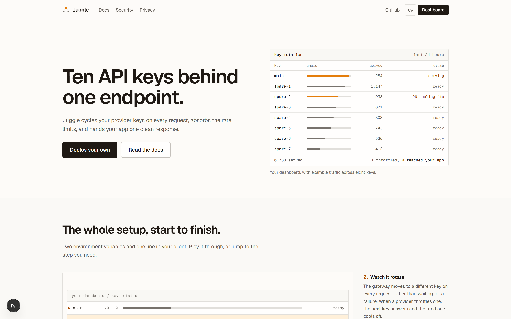
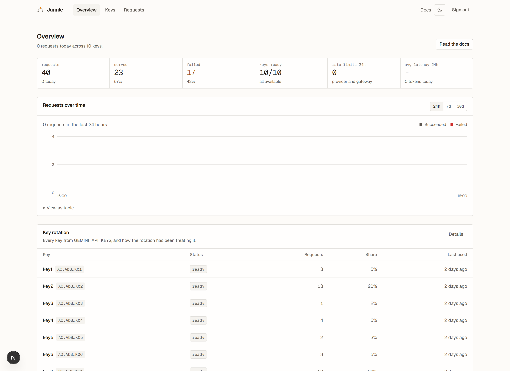
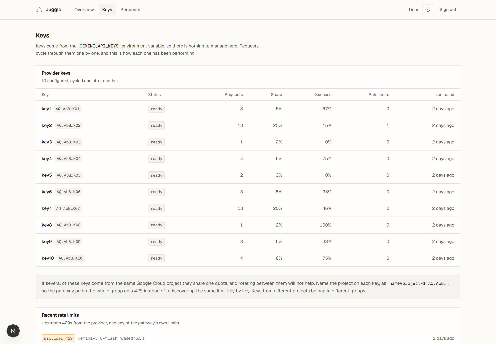
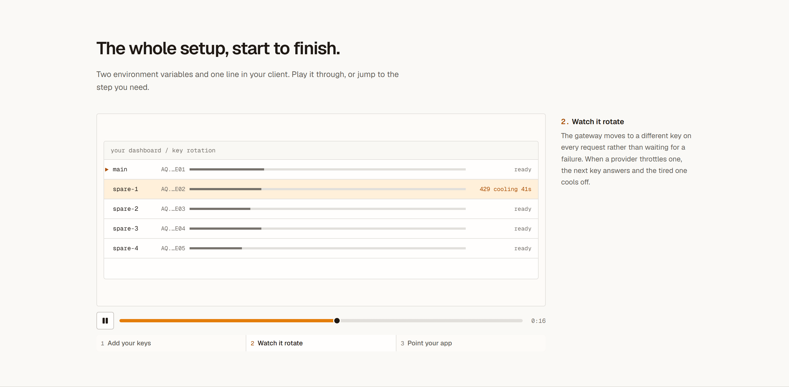

# Juggle

**Ten API keys behind one endpoint.**

Juggle is a self-hosted, open-source **bring-your-own-key AI gateway**. You put your provider API
keys in its environment; your applications call one OpenAI-compatible endpoint. Juggle cycles through
the keys on every request and absorbs the rate limits, so your app gets one clean response instead of
a 429.

```js
// Instead of giving every project its own provider key…
const client = new OpenAI({
  apiKey: process.env.JUGGLE_TOKEN,            // your gateway token
  baseURL: "https://your-gateway.vercel.app/v1",
});
```



Each deployment belongs to **one person**. You run your own instance, holding your own keys, with a
single password on the dashboard. There is no sign-up, no multi-tenancy, and no account to create.

Supported today: **Google Gemini**. The provider layer is an interface with pluggable adapters.

> Juggle has no models of its own and does not resell inference. Every request is served by a key you
> supplied and billed to your own provider account.

---

## Contents

- [Why this exists](#why-this-exists)
- [Quick start](#quick-start) — running locally in five minutes
- [Getting provider keys for free](#getting-provider-keys-for-free) — **and why ten keys is not ten times the quota**
- [Using it from your apps](#using-it-from-your-apps)
- [Tips for squeezing the most out of a free tier](#tips-for-squeezing-the-most-out-of-a-free-tier)
- [Configuration](#configuration)
- [Deploying to production](#deploying-to-production)
- [Running it](#running-it) — migrations, pruning, monitoring
- [Troubleshooting](#troubleshooting)
- [How it works](#how-it-works)
- [Security model](#security-model)
- [Roadmap](#roadmap)
- [License](#license)

---

## Why this exists

Provider rate limits are metered **per project and per model**, and a single key runs out at the worst
possible moment. The usual workarounds are pasting the same key into every project, or hand-rolling
retry logic in each one.

Juggle centralises both. Your apps hold one credential. Behind it sits a pool of provider keys and a
router that knows the difference between "this key is throttled for this one model", "this key is
dead", and "the provider is having a bad minute".

**What you get**

- **An OpenAI-compatible API.** `POST /v1/chat/completions` (streaming and not) and `GET /v1/models`.
  The official OpenAI SDKs work with only the API key and base URL changed.
- **Round-robin key cycling.** Every request goes to the least recently used healthy key, so ten keys
  serve ten consecutive requests. Spreading load is what stops a limit being reached at all.
- **Failover underneath it.** When a key is rate-limited or rejected anyway, the gateway retries on
  another key *inside the same request*. Your app never sees the 429.
- **Model-scoped cooldowns.** A key exhausted on Pro keeps serving Flash. An exhausted daily quota
  waits for the provider's actual reset instead of retrying all day.
- **Quota groups.** Gemini meters per Google Cloud project, so keys from one project cool down
  together rather than burning attempts one at a time. This matters more than anything else here —
  see [below](#the-one-thing-everyone-gets-wrong).
- **No secrets in the database.** Keys live in environment variables. The database holds usage
  statistics and a one-way fingerprint, nothing else.
- **A dashboard that shows which key is doing the work.** Per-key requests, success rate, share of
  traffic, rate limits, cooldowns and last use, plus a usage chart and a request log.
- **Limits that protect your bill.** Per-token and deployment-wide RPM, a daily cap, a concurrency
  limit, body-size limits, bounded retries and request deadlines.

| | |
|---|---|
|  |  |

---

## Quick start

**Requirements:** Node 22+ and pnpm 10+. No database server needed for local use.

```bash
git clone https://github.com/shreyeahhs/juggle.git
cd juggle
pnpm install
cp .env.example .env
```

Generate your secrets:

```bash
pnpm secrets:generate
```

That prints an `AUTH_SECRET`, an `OWNER_PASSWORD` and one `GATEWAY_API_KEYS` token. Paste all three
into `.env`, then add at least one provider key:

```ini
GEMINI_API_KEYS="AQ.Ab8YourRealKeyHere"
```

Don't have one yet? [Getting provider keys for free](#getting-provider-keys-for-free) is the next
section. Then:

```bash
pnpm db:migrate
pnpm dev
```

Open <http://localhost:3000>, sign in with your `OWNER_PASSWORD`, and send your first request:

```bash
curl http://localhost:3000/v1/chat/completions \
  -H "Authorization: Bearer gw_live_yourtoken" \
  -H "Content-Type: application/json" \
  -d '{
    "model": "gemini-3.8-flash",
    "messages": [{ "role": "user", "content": "Hello" }]
  }'
```

The request appears in the dashboard within a second, showing which key served it and how long it
took.

> **On the local database.** With no `DATABASE_URL`, development uses an embedded PostgreSQL (PGlite)
> in `./.data`. It allows **one process at a time**, so stop the dev server before running
> `pnpm db:migrate` or `pnpm db:prune`. The app says so plainly if you forget.

---

## Getting provider keys for free

Google's Gemini API has a genuinely usable free tier, and it is the reason this project exists.

### Creating your first key

1. Go to **[aistudio.google.com/apikey](https://aistudio.google.com/apikey)**.
2. Sign in with a Google account. No credit card, no billing setup.
3. Click **Create API key**.
4. Copy it. New keys look like `AQ.Ab8…` (Google moved to this format in May 2026; older keys start
   with `AIza…` and still work).

Add it to `GEMINI_API_KEYS` and you are done. That is the whole free tier: no billing account, no
trial clock.

### The one thing everyone gets wrong

Here is the trap, straight from [Google's own documentation](https://ai.google.dev/gemini-api/docs/rate-limits):

> Rate limits are applied per project, not per API key.

**Creating ten API keys inside one Google Cloud project gives you one project's quota, not ten.** The
keys are ten doors into the same room. You will hit exactly the same ceiling you had with one key, and
you will have spent an afternoon to get there.

To actually multiply your headroom you need **separate projects**:

1. At [aistudio.google.com/apikey](https://aistudio.google.com/apikey), click **Create API key**.
2. When prompted for a project, **create a new one** rather than reusing your existing project.
3. Repeat. AI Studio allows **a maximum of 10 projects at a time**, which is your real ceiling.

Now the crucial part — **tell Juggle which project each key came from**, using `name@group=key`:

```ini
GEMINI_API_KEYS="main@proj-1=AQ.Ab8...1,spare-1@proj-2=AQ.Ab8...2,spare-2@proj-3=AQ.Ab8...3"
```

The group name is arbitrary; it only has to match for keys that share a project. With this set, a 429
on any key cools down its whole group at once, because the gateway knows the other keys in that
project are equally spent.

**Get this wrong in either direction and you lose:**

| Configuration | What happens |
|---|---|
| Keys from 3 projects, no groups | A 429 on one key teaches the gateway nothing about the others. It burns an attempt rediscovering the same limit on each key in that project. |
| Keys from 3 projects, all in one group | One project's exhaustion parks keys that still have full quota. You paid for three projects and get one. |
| Keys from 3 projects, one group each | Correct. Each project's quota is tracked independently and failover skips straight to a project with headroom. |

If every key you own genuinely comes from one project, skip the inline syntax and set
`GEMINI_QUOTA_GROUP="default"` instead. Same effect, less typing.

### What the free tier actually gives you

Google does not publish free-tier numbers in its docs, because they change and they differ per
account. **Check your own limits at [aistudio.google.com](https://aistudio.google.com/apikey)** rather
than trusting any number you read in a blog post — including this one.

What is stable and worth knowing:

- Limits are expressed as **RPM** (requests per minute), **TPM** (tokens per minute) and **RPD**
  (requests per day).
- **RPD resets at midnight Pacific time.** Not at your midnight, and not 24 hours after your first
  request. Juggle knows this and parks an exhausted daily key until the real reset instead of retrying
  against it all day.
- Limits are **per model**. A key exhausted on Pro still has its full Flash quota, which Juggle tracks
  separately.
- Flash-tier models get considerably more free headroom than Pro. If you need volume, Flash is the
  answer.
- Google's tiers escalate automatically: **Free** → **Tier 1** (link a billing account) → **Tier 2**
  ($100 spent, 3 days) → **Tier 3** ($1,000 spent, 30 days). Linking billing raises your limits sharply
  even before you spend anything — if you have a card you are willing to attach, that is a bigger win
  than any key-pooling trick, and Juggle's daily cap will keep the bill at zero.

### Two things to be straight about

**Free-tier prompts are used to train Google's models.** Google's pricing page states free-tier
content is "used to improve our products". The paid tier is excluded. Juggle never stores your prompts
— there is no database column for one — but it cannot change what the provider does with a request
after it forwards it. **Do not route confidential or personal data through free-tier keys.** If you
need that, link billing and use the paid tier.

**Multiple projects are fine; multiple accounts are not.** Creating several Google Cloud projects under
one account is a documented, supported feature, and that is what everything above describes. Creating
a farm of Google accounts to multiply a free tier violates Google's Terms of Service and gets the lot
of them banned. Juggle is built for the first thing. Where your keys come from is on you.

### Other providers

Adapters for **OpenAI, Anthropic, Groq, OpenRouter, Mistral and Cerebras** are on the
[roadmap](#roadmap) but **are not implemented yet** — a key for any of them will not work today.
Several of those have free tiers worth pooling once the adapters land, and the internal request format
is already OpenAI-shaped, so most of the remaining work per provider is error mapping.

---

## Using it from your apps

Juggle speaks the OpenAI Chat Completions format. For most clients, two lines change: the base URL and
the key.

<details open>
<summary><b>OpenAI SDK — JavaScript / TypeScript</b></summary>

```js
import OpenAI from "openai";

const client = new OpenAI({
  apiKey: process.env.JUGGLE_TOKEN,
  baseURL: "https://your-gateway.vercel.app/v1",
});

const completion = await client.chat.completions.create({
  model: "gemini-3.8-flash",
  messages: [{ role: "user", content: "Hello" }],
});

console.log(completion.choices[0].message.content);
```

</details>

<details>
<summary><b>OpenAI SDK — Python</b></summary>

```python
import os
from openai import OpenAI

client = OpenAI(
    api_key=os.environ["JUGGLE_TOKEN"],
    base_url="https://your-gateway.vercel.app/v1",
)

completion = client.chat.completions.create(
    model="gemini-3.8-flash",
    messages=[{"role": "user", "content": "Hello"}],
)

print(completion.choices[0].message.content)
```

</details>

<details>
<summary><b>Streaming</b></summary>

```js
const stream = await client.chat.completions.create({
  model: "gemini-3.8-flash",
  messages: [{ role: "user", content: "Write a haiku about rate limits" }],
  stream: true,
});

for await (const chunk of stream) {
  process.stdout.write(chunk.choices[0]?.delta?.content ?? "");
}
```

Server-sent events are forwarded without buffering, so time-to-first-token is the provider's, not
the provider's plus Juggle's.

</details>

<details>
<summary><b>Vercel AI SDK</b></summary>

```ts
import { createOpenAI } from "@ai-sdk/openai";
import { generateText } from "ai";

const juggle = createOpenAI({
  apiKey: process.env.JUGGLE_TOKEN,
  baseURL: "https://your-gateway.vercel.app/v1",
});

const { text } = await generateText({
  model: juggle("gemini-3.8-flash"),
  prompt: "Hello",
});
```

</details>

<details>
<summary><b>LangChain (Python)</b></summary>

```python
from langchain_openai import ChatOpenAI

llm = ChatOpenAI(
    model="gemini-3.8-flash",
    api_key=os.environ["JUGGLE_TOKEN"],
    base_url="https://your-gateway.vercel.app/v1",
)
```

</details>

<details>
<summary><b>Editor assistants (Continue, Cline, Aider, Zed…)</b></summary>

Anything that accepts a custom OpenAI-compatible endpoint works. In Continue's `config.json`:

```json
{
  "models": [
    {
      "title": "Juggle",
      "provider": "openai",
      "model": "gemini-3.8-flash",
      "apiBase": "https://your-gateway.vercel.app/v1",
      "apiKey": "gw_live_yourtoken"
    }
  ]
}
```

</details>

<details>
<summary><b>Raw fetch, no SDK</b></summary>

```js
const response = await fetch("https://your-gateway.vercel.app/v1/chat/completions", {
  method: "POST",
  headers: {
    Authorization: `Bearer ${process.env.JUGGLE_TOKEN}`,
    "Content-Type": "application/json",
  },
  body: JSON.stringify({
    model: "gemini-3.8-flash",
    messages: [{ role: "user", content: "Hello" }],
  }),
});

const data = await response.json();
```

</details>

### Model names

Three forms all work and resolve to the same upstream model:

```
gemini-3.8-flash            the provider's own name
gemini/gemini-3.8-flash     provider-prefixed, unambiguous with several providers configured
models/gemini-3.8-flash     Gemini's resource-style name
```

`GET /v1/models` asks your provider for its live list, so it is never a stale hard-coded array.

### Response headers

| Header | Meaning |
|---|---|
| `x-request-id` | Correlates the response with the dashboard's request log. |
| `x-juggle-attempts` | How many keys it took. `1` is the happy path; `2` means one key was throttled and you never noticed. |
| `x-ratelimit-limit-requests` / `-remaining-requests` / `-reset-requests` | **Juggle's** own per-token limit, not the provider's. |
| `retry-after` | Present on a 429 or 503, in seconds. |

Errors use OpenAI's envelope — `{ "error": { "message", "type", "code", "param", "request_id" } }` —
so SDK error classes and their automatic retries behave exactly as they do against OpenAI.

Full API documentation ships with the app at **`/docs`**.

---

## Tips for squeezing the most out of a free tier

**Spread keys across projects, and group them.** Everything in
[the one thing everyone gets wrong](#the-one-thing-everyone-gets-wrong). This is worth more than every
other tip here combined.

**Pin `gemini-flash-latest` for side projects, a version for production.** Google retires model names,
and a retired name starts returning `404` for accounts that never used it — even while it still looks
current. `gemini-flash-latest` and `gemini-pro-latest` always point at the current release and give a
two-week deprecation notice. A pinned name like `gemini-3.8-flash` keeps behaviour stable until you
move it yourself. Note that access to the 2.5 series is now limited to accounts that already used it,
so a tutorial recommending `gemini-2.5-flash` will 404 on a new project.

**Reach for the smallest model that works.** Flash-Lite handles classification, extraction, routing and
summarising perfectly well, gets the most generous free limits, and answers fastest. Save Pro for
things that actually need it. Because Juggle scopes cooldowns per model, mixing models across your
workload draws on independent quota buckets.

**Schedule batch work just after midnight Pacific.** That is when RPD resets. A nightly job at 00:05
Pacific gets the full day's allowance to itself.

**Set `GATEWAY_DAILY_REQUESTS` below your real ceiling.** It is a circuit breaker for runaway loops.
A bug that retries forever is the thing most likely to burn your quota, and it always happens at 3am.

**Give each app its own gateway token.** `GATEWAY_API_KEYS="web=gw_live_...,cron=gw_live_...,cli=gw_live_..."`
costs nothing and the dashboard then tells you which app is eating your quota. Revoking one app's
access becomes deleting one entry instead of rotating everything.

**Keep gateway tokens on your server.** Leave `GATEWAY_CORS_ORIGINS` empty (the default). A token in
frontend JavaScript is a public token, and then your provider keys are funding whoever finds it.

**Stream anything a human waits for.** It costs the same and feels several times faster.

**Cache in your app.** Juggle deliberately does not cache — it has no idea whether your prompt is
cacheable. Identical prompts are common in production, and a cache hit is the cheapest request there
is.

**Watch the per-key success rate.** A key stuck near 0% is revoked, deleted or attached to a disabled
project. Juggle marks it `invalid` and stops trying, but it is still one fewer key in your pool, and
the dashboard is where you notice.

**`round_robin` unless you have a reason.** It is the default and it is strictly least-recently-used,
which spreads load most evenly. Switch to `power_of_two` only when many requests are in flight at once
and you see collisions.

---

## Configuration

Every variable is documented inline in [`.env.example`](.env.example). The required ones:

| Variable | Notes |
|---|---|
| `AUTH_SECRET` | Signs the dashboard session and derives key fingerprints. 32+ characters. `pnpm secrets:generate`. |
| `OWNER_PASSWORD` | The dashboard password. This deployment has no other account. |
| `GEMINI_API_KEYS` | Comma-separated provider keys. Optionally named: `spare=AQ.Ab8…`. Add the project a key belongs to with `spare@proj-2=AQ.Ab8…`. |
| `GATEWAY_API_KEYS` | Comma-separated tokens your apps send. Optionally named: `prod=gw_live_…`. |
| `DATABASE_URL` | PostgreSQL, for statistics and shared cooldowns. Required in production. |
| `APP_URL` | Public URL of the deployment. Must be `https://` in production. |

Worth knowing about:

| Variable | Default | Notes |
|---|---|---|
| `GEMINI_QUOTA_GROUP` | — | Default quota group. Set only when **every** key shares one Google Cloud project. |
| `GATEWAY_KEY_STRATEGY` | `round_robin` | Or `power_of_two`. |
| `GATEWAY_TOKEN_RPM` | `120` | Per gateway token, per minute. |
| `GATEWAY_TOTAL_RPM` | `300` | Whole deployment, per minute. |
| `GATEWAY_DAILY_REQUESTS` | `20000` | Whole deployment, per day. Your circuit breaker. |
| `GATEWAY_MAX_CONCURRENCY` | `20` | In-flight upstream requests. |
| `GATEWAY_MAX_ATTEMPTS` | `5` | Upstream attempts per request, across all keys. |
| `GATEWAY_CORS_ORIGINS` | *(empty)* | Browser origins allowed to call `/v1` directly. Empty is recommended. |
| `REQUEST_LOG_RETENTION_DAYS` | `30` | `pnpm db:prune` deletes anything older. |
| `RUN_MIGRATIONS` | `false` | Apply pending migrations at startup. Handy for single-container deploys. |
| `TRUST_PROXY` | `false` | Set `true` **only** behind a proxy that sets `x-forwarded-for` (Vercel, Fly, nginx). |
| `LOG_LEVEL` | `info` | |

Changing keys means editing an environment variable and redeploying. Statistics follow a key by its
fingerprint, so renaming one keeps its history, and re-adding one picks it back up.

---

## Deploying to production

### Vercel

1. Fork this repository and import it on Vercel.
2. Add a PostgreSQL database so `DATABASE_URL` is set. Neon, Vercel Postgres and Supabase all have
   free tiers that are ample for statistics.
3. Set the environment variables, with `RUN_MIGRATIONS=true` for the first deploy:

   ```ini
   AUTH_SECRET="..."                       # pnpm secrets:generate
   OWNER_PASSWORD="..."                    # your dashboard password
   GEMINI_API_KEYS="a@p1=AQ.Ab8...,b@p2=AQ.Ab8..."
   GATEWAY_API_KEYS="gw_live_..."
   DATABASE_URL="postgres://..."
   APP_URL="https://your-gateway.vercel.app"
   TRUST_PROXY="true"
   RUN_MIGRATIONS="true"
   ```

4. Deploy, open the URL, and sign in with `OWNER_PASSWORD`.

Set the variables for **all** environments, or preview deploys will fail their health check. After the
first successful deploy you can set `RUN_MIGRATIONS=false` and run `pnpm db:migrate` as a release step
instead.

**Put the function in the same region as your database.** This is the single biggest performance
lever, and the default gets it wrong: Vercel runs functions in `iad1` (Washington DC) unless told
otherwise, so a database in, say, London means every query crosses the Atlantic. The dashboard issues
several queries per render, and that adds up fast. [`vercel.json`](vercel.json) pins the region:

```json
{ "regions": ["lhr1"] }
```

Change `lhr1` to match wherever your database lives — `iad1` for us-east-1, `fra1` for eu-central-1,
`sfo1` for us-west-1. Your deployment's actual region is in the `x-vercel-id` response header, which
reads `<edge>::<function>::<id>`; it is the middle one that matters.

> Streaming responses on Vercel's serverless functions are subject to your plan's maximum duration.
> Long generations are the one place a container host is the easier choice.

### Docker Compose

Brings its own PostgreSQL and applies migrations at startup:

```bash
cp .env.example .env
pnpm secrets:generate          # paste the output into .env
# then set POSTGRES_PASSWORD, APP_URL and GEMINI_API_KEYS
docker compose up -d
```

The database is not published to the host — only the app container can reach it. Data lives in the
`postgres-data` volume, so `docker compose down` keeps your statistics and `down -v` destroys them.

If you scale past one replica, set `RUN_MIGRATIONS=false` and migrate as a release step so instances
don't migrate concurrently.

### A container anywhere else

The [`Dockerfile`](Dockerfile) produces a small non-root image running Next.js in standalone mode,
with a `HEALTHCHECK` against `/api/health`. It takes no build arguments and no build-time secrets —
every value is read per request — so the same image runs in every environment.

```bash
docker build -t juggle .
docker run -p 3000:3000 --env-file .env juggle
```

That works as-is on Fly.io, Railway, Render, Koyeb, a VPS behind nginx, or anything else that runs a
container. Point your platform's health check at **`/api/health`**, which returns `200 {"status":"ok"}`
when the database is reachable and `503` when it is not.

### Bare Node

`next.config.ts` sets `output: "standalone"`, so the build emits a self-contained server rather than
something `next start` serves. Three details catch people out here, so they are spelled out:

```bash
pnpm install --frozen-lockfile
pnpm build
pnpm db:migrate

# 1. The standalone bundle does not include static assets. Copy them in.
cp -r .next/static .next/standalone/.next/static

# 2. Run the emitted server, not `next start`.
#    (`next start` warns that it does not work with standalone output.)
node .next/standalone/server.js
```

**3. The standalone server does not read your project's `.env`.** It reads the real process
environment, so export the variables, use your init system's environment file, or copy `.env` next to
`server.js`. Starting it without them fails immediately and tells you which are missing — it will not
limp along on defaults.

`pnpm start` is fine for a quick local look at a production build, but the standalone server is what
you deploy.

### Production checklist

- [ ] `APP_URL` is your real `https://` URL. It is used to build absolute URLs and is enforced as
      HTTPS in production.
- [ ] `AUTH_SECRET` is 32+ random characters and **differs from every other environment**. Changing it
      invalidates sessions and resets key fingerprints, which orphans your statistics.
- [ ] `OWNER_PASSWORD` is not the one `pnpm secrets:generate` printed into your shell history.
- [ ] `DATABASE_URL` is set. In production the app **refuses to start without it** rather than quietly
      falling back to the embedded development database.
- [ ] `TRUST_PROXY=true` **if and only if** you are behind a proxy that sets `x-forwarded-for`. Setting
      it without one lets a client spoof its IP past the auth-failure throttle.
- [ ] `GATEWAY_CORS_ORIGINS` is empty unless a browser genuinely must call `/v1` directly.
- [ ] `GATEWAY_DAILY_REQUESTS` is set to something you would be comfortable paying for.
- [ ] Provider keys are set through your platform's secret store, not committed anywhere.
- [ ] `pnpm db:prune` is scheduled (see below).
- [ ] You have confirmed `/api/health` returns 200 and the dashboard signs in.

Security headers — CSP, HSTS, `X-Frame-Options: DENY`, `nosniff`, a locked-down `Permissions-Policy` —
are set for every response in [`next.config.ts`](next.config.ts) and need no configuration.

---

## Running it

**Migrations.** `pnpm db:migrate` applies pending SQL from [`drizzle/`](drizzle). Set
`RUN_MIGRATIONS=true` to apply them at startup instead, which suits single-container deployments.

**Pruning.** Request metadata accumulates. `pnpm db:prune` deletes anything older than
`REQUEST_LOG_RETENTION_DAYS`. Run it on a schedule — a daily cron, a Vercel Cron job, or a
`docker compose exec`. Nothing breaks if you don't; the table just grows.

**Health.** `GET /api/health` is unauthenticated and contentless by design: `200 {"status":"ok"}`, or
`503 {"status":"degraded","database":"unreachable"}`.

**Rotating a provider key.** Add the new key, deploy, confirm it is serving traffic in the dashboard,
then remove the old one and deploy again. No downtime, and the old key's history stays intact.

**Rotating a gateway token.** Add a second token, migrate your apps to it, then remove the first.
Multiple tokens are the supported path precisely so this needs no downtime.

**Backups.** The database holds statistics and cooldown state — useful, but not irreplaceable. Your
provider keys are in your environment, so **your platform's environment variables are the thing you
cannot regenerate.** Keep them in a password manager.

**Upgrading.** `git pull`, `pnpm install`, `pnpm build`, `pnpm db:migrate`, restart. Migrations are
additive.

---

## Troubleshooting

| Symptom | What it means |
|---|---|
| `401 invalid_api_key` | The token your app sent is not in `GATEWAY_API_KEYS`. Check for a stray space or a missing comma. |
| `400 no_provider_keys` | `GEMINI_API_KEYS` is empty or unparseable. |
| `400 no_active_provider_keys` | Every key is cooling down or marked invalid. The dashboard's keys page shows which and until when. |
| `404 model_not_found` | The provider doesn't have that model **for your account**. Availability is per account, so someone else's working model proves nothing. Try `gemini-flash-latest`. |
| `400 model_not_supported` | No configured provider recognises that name at all. Check the spelling. |
| `400 unsupported_parameter` | A parameter Juggle cannot honour yet — tool calling, `response_format`, image inputs, `reasoning_effort`. Named explicitly rather than silently dropped, because a wrong answer is worse than a clear error. |
| `503 attempts_exhausted` | Every attempt failed. Usually all keys throttled at once, which means your pool is too small or all in one project. |
| `429 rate_limit_exceeded` | **Juggle's** limit, not the provider's. Raise `GATEWAY_TOKEN_RPM` or `GATEWAY_TOTAL_RPM`. |
| `429 daily_quota_exceeded` | Your `GATEWAY_DAILY_REQUESTS` cap. Working as intended. |
| Keys show `invalid` | The provider returned 401 or 403. The key is revoked, deleted, or its project has the API disabled. Verify it at aistudio.google.com. |
| All keys throttle together | They share a Google Cloud project. Either group them so Juggle knows, or create keys in separate projects. |
| `PGlite: database is locked` | Two processes want the embedded database. Stop the dev server before running db scripts. |
| Dashboard signs you out repeatedly | `AUTH_SECRET` differs between instances, or changed on redeploy. |
| `Invalid environment configuration` on startup | Validation runs on first request and names every offending variable without printing values. In production it additionally requires `DATABASE_URL` and an `https://` `APP_URL`. |
| `AUTH_SECRET still looks like a placeholder` | In production, `AUTH_SECRET` and `OWNER_PASSWORD` are rejected if they contain `changeme`, `example`, `placeholder` or **`password`**. A dashboard password of `mypassword123` trips this. Pick something else — ideally what `pnpm secrets:generate` produced. |

Every error response carries `x-request-id`; search for it in the dashboard's request log to see the
full attempt chain.

---

## How it works

```text
                         ┌──────────────────────────────────────────────────────┐
  Browser (dashboard) ──►│  UI layer       Next.js App Router, Server            │
   signed cookie         │                 Components, Server Actions            │
                         ├──────────────────────────────────────────────────────┤
  Your app ────────────► │  Gateway layer  /v1/*  (framework-agnostic core:      │
   Bearer <token>        │                 Web Request → Web Response)           │
                         │   auth → limits → validate → ROUTER → respond → log   │
                         ├──────────────────────────────────────────────────────┤
                         │  Domain layer   provider adapters, key store, stats   │
                         └───────┬──────────────────┬───────────────────┬────────┘
                                 │                  │                   │
                          Environment          PostgreSQL         Provider APIs
                        (keys and tokens)  (stats, cooldowns)    (Gemini, more later)
```

One request, end to end:

```text
POST /v1/chat/completions
  1  size & content-type guard ........ 413 / 415
  2  IP auth-failure throttle ......... 429
  3  token check (constant time) ...... 401
  4  limits ........................... 429   (token RPM, total RPM, daily, concurrency)
  5  parse + validate ................. 400   (names the offending parameter)
  6  resolve provider + model ......... 400 / 404
  7  ROUTER  ─┬─ pick the least recently used healthy key
              ├─ call provider
              ├─ classify: rate limited │ invalid key │ permission │ transient │ caller error
              ├─ persist cooldown / invalidation / breaker state
              └─ rotate, back off, or return, within bounded attempts
  8  respond (JSON, or SSE forwarded without buffering)
  9  log metadata only; release the concurrency slot
```



The routing engine in `src/server/gateway/router.ts` depends only on interfaces: a `KeyStore`, a
provider adapter, a clock and a random source. It knows nothing about HTTP or SQL.

---

## Security model

- Provider keys live in the deployment's **environment**, never in the database. A database dump, a
  backup or a leaked connection string contains no key material.
- What is stored per key is a **fingerprint**: an HMAC keyed with this deployment's `AUTH_SECRET`. It
  identifies a key across restarts and cannot be reversed.
- Keys are **never echoed back**. The dashboard shows a hint like `AQ.A…E02` and nothing more.
  Credential-shaped strings are scrubbed from every log line and from every error the gateway returns,
  including errors relayed from a provider.
- **Never an open proxy.** Every request is authenticated, then rate limited per token and across the
  deployment. Upstream hosts are fixed in adapter code and model names are pattern-validated, so no
  request body can point the gateway somewhere else.
- **Prompts are not stored.** There is no column for a prompt or a response, so there is nothing to
  leak and nothing to switch off. Usage records hold timing, status, model and token counts.
- Gateway tokens are compared in constant time and never persisted in plaintext.
- The dashboard is one password and a signed, http-only cookie. Sign-in attempts are rate limited per
  IP.

**The trade-off, stated plainly:** anyone who can read your deployment's environment can read your
provider keys, exactly as with any environment-configured service. That is what removes the encrypted
vault and its key-rotation machinery from this project, and it is written down rather than hidden.

Reporting a vulnerability: [SECURITY.md](SECURITY.md).

---

## Roadmap

- Tool calling, structured outputs, image inputs and reasoning-effort pass-through
- More providers: OpenAI, Anthropic, Groq, OpenRouter, Mistral, Cerebras
- `/v1/responses` and `/v1/embeddings`
- Health-scored routing and model fallbacks

---

## License

[MIT](LICENSE). Run it, fork it, sell what you build with it.
